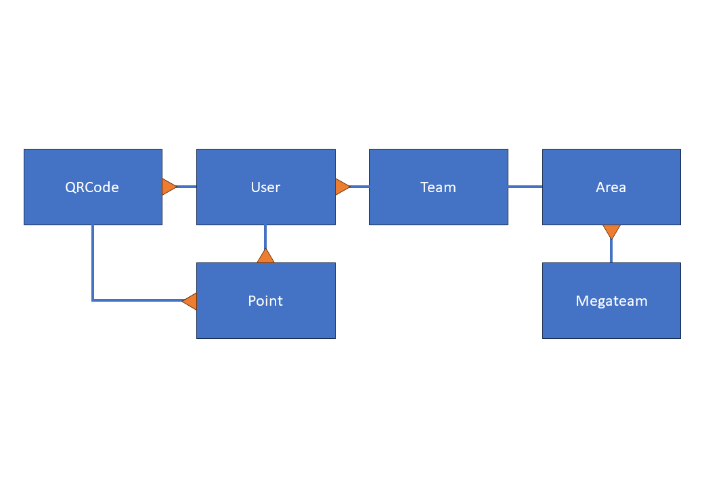

[Database Guidelines Pulled From Here](https://dev.to/ovid/database-naming-standards-2061)

# Database Rules

- Use underscore_names instead of CamelCase
- Table names should be plural
- Spell out id fields (item_id instead of id)
- Don't use ambiguous column names
- When possible, name foreign key columns the same as the columns they refer to

# User, Team, Megateam relationship

Each user can create or join a team

Each team can enter what area they are working at

Each area is associated with a megateam

User -> Team -> Area -> Megateam

## Entity Relationship Diagram

## Notes on implications

- If a user changes team, their points would change to be added to that team
- If a team changed area, their points would change to be added to that area's megateam
  > After initially selecting a location, the only people that can reassign locations/megateams for a team would be volunteers and admin users (see [#3](https://github.com/ducompsoc/durhack-megateams/issues/3), [#4](https://github.com/ducompsoc/durhack-megateams/issues/4))
  > 
  > [@tameTNT](https://github.com/ducompsoc/durhack-megateams/commit/adc509d79f99c4e7d4cd88d3944f34c28bfc0da7#r116757013)
- Abuse will be prevented by only allowing volunteers and admins to change team/megateam association

# QR Codes & Points
## Create QR Code

Required:

- common name/description/purpose of code
- type/category of code (e.g. Workshop)
- points value
- use limit
- start time
- end time

_NB: presets will be available which automatically set many of these options_

Optional:

- state (whether it can be successfully redeemed)

## Redeem Points (QR Code)

Required:

- QR Code ID
- User ID redeeming

Backend Requirements:

- Retrieve Points Amount of QR Code and pass in SQL Insert Statement

## Redeem Points (Manual)

Required:

- Points Amount
- Admin User ID (requires authentication of course)
- User ID 'redeeming' (selects which team/megateam to affect)
